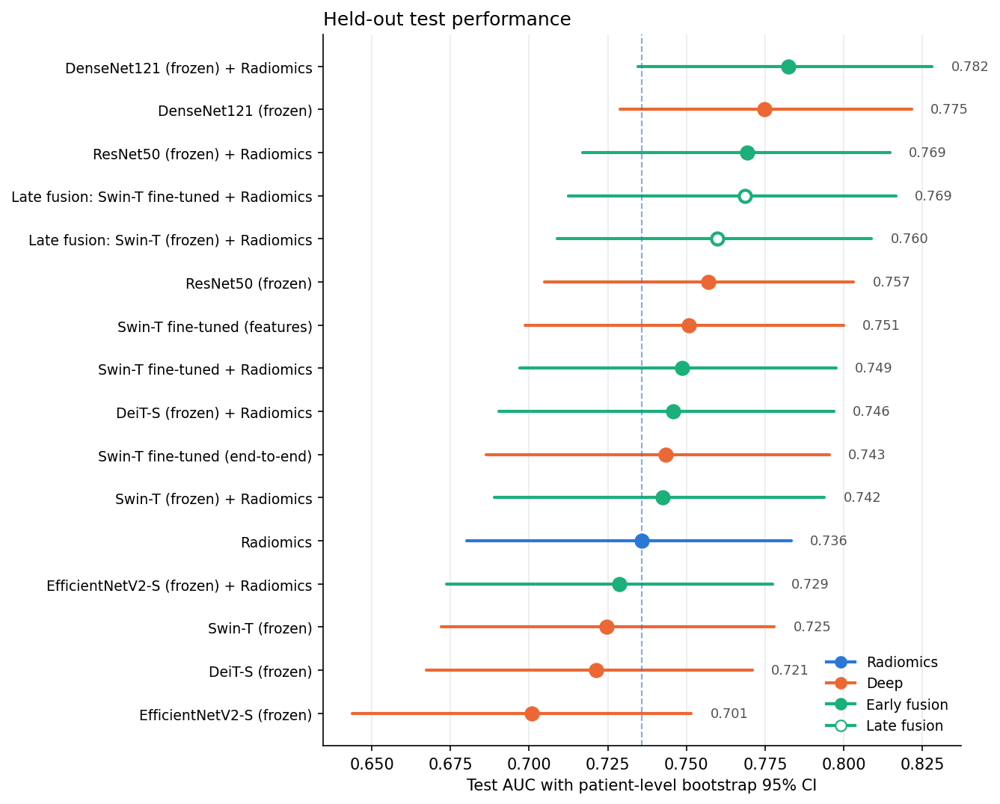

# Radiomics × Deep Learning Feature Fusion for Breast Lesion Classification

Benign vs malignant classification of mammographic lesions from **CBIS-DDSM**, comparing
hand-crafted **radiomics**, **deep features** from five ImageNet backbones, and their **fusion**.

## Highlights
- **2,437 lesion ROIs** (calcifications + masses) with 93 PyRadiomics features from
  [CBIS-DDSM-R](https://huggingface.co/datasets/helloerikaaa/cbis-ddsm-r), matched one-to-one to their cropped ROI images.
- **Leakage-safe evaluation:** patient-grouped train/test split, all preprocessing and feature selection inside CV
  pipelines, fine-tuning on training patients only, and a single final evaluation on the held-out test set.
- **Backbones:** ResNet50, DenseNet121, EfficientNetV2-S, Swin-T, DeiT-S (frozen), plus partial fine-tuning of the best one.
- **Fusion:** early (feature concatenation → XGBoost) and late (probability averaging).
- **Statistics:** patient-level bootstrap 95% CIs and paired bootstrap tests of the fusion gain; subgroup results for
  calcifications vs masses; importance share of radiomics vs deep features in the fused model.

## Results (held-out test set)

AUC on 20% of patients held out, with patient-level bootstrap 95% CIs (full table: `outputs/results_test.md`).

| Model | AUC (95% CI) |
|---|---|
| Radiomics only (93 features) | 0.736 (0.680–0.783) |
| Swin-T frozen *(CV-selected backbone)* | 0.725 |
| Swin-T frozen + radiomics | 0.742 (0.689–0.794) |
| Swin-T fine-tuned (end-to-end) | 0.743 (0.686–0.795) |
| Swin-T fine-tuned + radiomics | 0.749 (0.697–0.798) |
| DenseNet121 frozen | 0.775 (0.729–0.822) |
| **DenseNet121 frozen + radiomics** | **0.782 (0.735–0.828)** |

**Takeaways**
- **Deep features beat radiomics.** DenseNet121 reached 0.775 AUC vs 0.736 for radiomics.
- **Fusion adds a small lift that is mostly not significant.** Early fusion improved frozen backbones by +0.007 to +0.028 AUC,
  but changed fine-tuned Swin-T by −0.002. The paired-bootstrap CIs for early fusion include 0 (e.g. Swin-T +0.018, −0.003 to +0.039, p = 0.08).
  Late fusion beat end-to-end fine-tuned Swin-T by +0.025 (+0.002 to +0.048, p = 0.04), a single comparison among several, not corrected for multiple testing.
  Radiomics are 11% of the fused inputs but carry 7% of the model's gain, so much of their information already exists in the CNN embedding.
- **Partial fine-tuning of Swin-T** gave +0.019 AUC over frozen (p = 0.40) on ~1,900 training ROIs.
- **Model selection was done honestly.** Training-set CV chose Swin-T. DenseNet121 scored higher on the test set, but
  that ranking is post hoc and lies within the CIs.

## Method
1. **Data** — radiomics table (Hugging Face) joined to the Kaggle JPEG release of CBIS-DDSM through the ROI series UID.
   `MALIGNANT` = 1, `BENIGN` / `BENIGN_WITHOUT_CALLBACK` = 0.
2. **Split** — 80/20 by patient (`StratifiedGroupKFold`); model selection by 5-fold patient-grouped CV on the training set.
3. **Radiomics** — XGBoost / SVM / logistic regression baselines; LASSO, RFE and consensus feature selection.
4. **Deep features** — CLAHE-enhanced ROIs, 224×224, pooled embeddings from frozen `timm` backbones.
5. **Fine-tuning** — last stage + head of the best backbone, class-weighted loss, cosine LR, checkpoint chosen on an inner validation split.
6. **Evaluation** — AUC, sensitivity, specificity, F1, accuracy on the test set; bootstrap CIs and paired comparisons.

## Running it
Open `breast_lesion_classification.ipynb` on Kaggle with a GPU, attach
[`awsaf49/cbis-ddsm-breast-cancer-image-dataset`](https://www.kaggle.com/datasets/awsaf49/cbis-ddsm-breast-cancer-image-dataset),
enable internet, and *Run All* (≈25–40 min on a T4). Settings live in the first code cell.
Figures, cached features and result tables are written to `outputs/`.

Requirements: `torch`, `torchvision`, `timm`, `xgboost`, `scikit-learn`, `opencv-python`, `datasets`, `pandas`, `matplotlib`.

## Limitations
Single held-out split; pre-cropped ROIs (characterisation, not detection); 8-bit JPEGs rather than original DICOMs;
calcifications and masses pooled in one model; fixed 0.5 decision threshold. See Section 9 of the notebook.

## Data credits
CBIS-DDSM: Lee R.S. et al., *A curated mammography data set for use in computer-aided detection and diagnosis research*,
Scientific Data 4, 170177 (2017). Radiomics features: CBIS-DDSM-R (Hugging Face). Images: Kaggle JPEG conversion by awsaf49.
